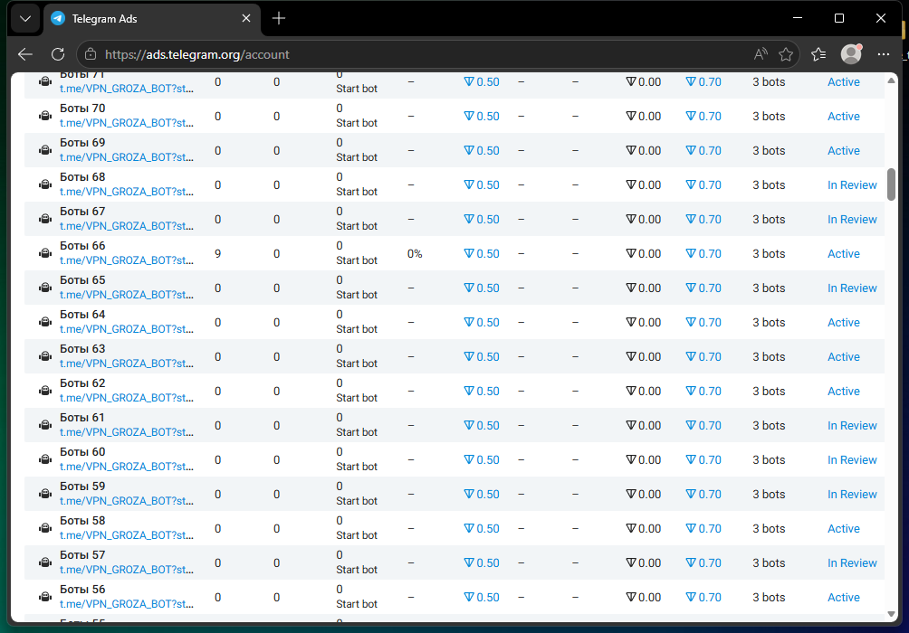

# 🚀 Telegram Ads Launcher

Минимальный лаунчер для Telegram Ads. В проекте оставлены только 3 режима:



1. ➕ Добавлять объявления из `data/bots.txt` или `data/channel.txt`
2. 🔎 Проверить цели и удалить плохие в `data/low-bots.txt` или `data/low-channel.txt`
3. 🎯 Калибровать координаты проверки

## 📦 Установка

```powershell
git clone <URL_РЕПОЗИТОРИЯ>
cd <ПАПКА_РЕПОЗИТОРИЯ>
python -m venv .venv
.\.venv\Scripts\Activate.ps1
pip install -r requirements.txt
```

Запуск:

```powershell
python launcher.py
```

## 📁 Данные

Входные списки лежат в папке `data`:

- `data/bots.txt` - боты, по одному в строке
- `data/channel.txt` - каналы, по одному в строке

Можно писать так:

```text
@example_bot
example_channel
https://t.me/example_bot
```

Плохие цели скрипт записывает отдельно:

- `data/low-bots.txt`
- `data/low-channel.txt`

Уже использованные и временно ожидающие цели также сохраняются в `data/used-*` и `data/pending-*`.

## ⚙️ Как работает

Режим `1` берет цели из выбранного файла, группирует их и заполняет форму Telegram Ads по сохраненным координатам. Для ботов используется группа по 3 цели, для каналов - по 5 целей. Скрипт заполняет заголовок, описание, URL, CPM, бюджет, цели и нажимает создание объявления.

Режим `2` проверяет выбранный список через форму Telegram Ads. Если после добавления цели появляется красная ошибка про недостаточную аудиторию, цель переносится в соответствующий low-файл и удаляется из исходного списка.

Режим `3` сохраняет координаты для проверки. Каждый пользователь может откалибровать их под свое окно, масштаб экрана и браузер.

## 🎯 Калибровка

Перед калибровкой открой Telegram Ads и форму создания объявления.

Важно: сначала вручную заполни `Ad title`, потом `Ad text`/описание. После заполнения этих полей форма сдвигается, и координаты для следующих полей будут сняты в правильных местах.

Тексты объявлений в скрипте рассчитаны примерно на 135-145 символов. Это важно для стабильного положения полей при калибровке и заполнении.

Во время калибровки консоль будет просить навести мышь на нужное поле или область и нажать `Enter`. Не меняй размер окна после калибровки.

## 🧪 Отладка

- Запусти `python launcher.py`
- Выбери режим `3` и сохрани координаты.
- Заполни `data/bots.txt` или `data/channel.txt`.
- Выбери режим `2`, проверь небольшой лимит, например `3`.
- Если проверка работает, запускай режим `1`.

Экстренная остановка во время автоматизации: `F4`.

## ⬇️ Скачивание

После загрузки на GitHub пользователи смогут скачать проект через `Code -> Download ZIP` или установить через `git clone <URL_РЕПОЗИТОРИЯ>`.
